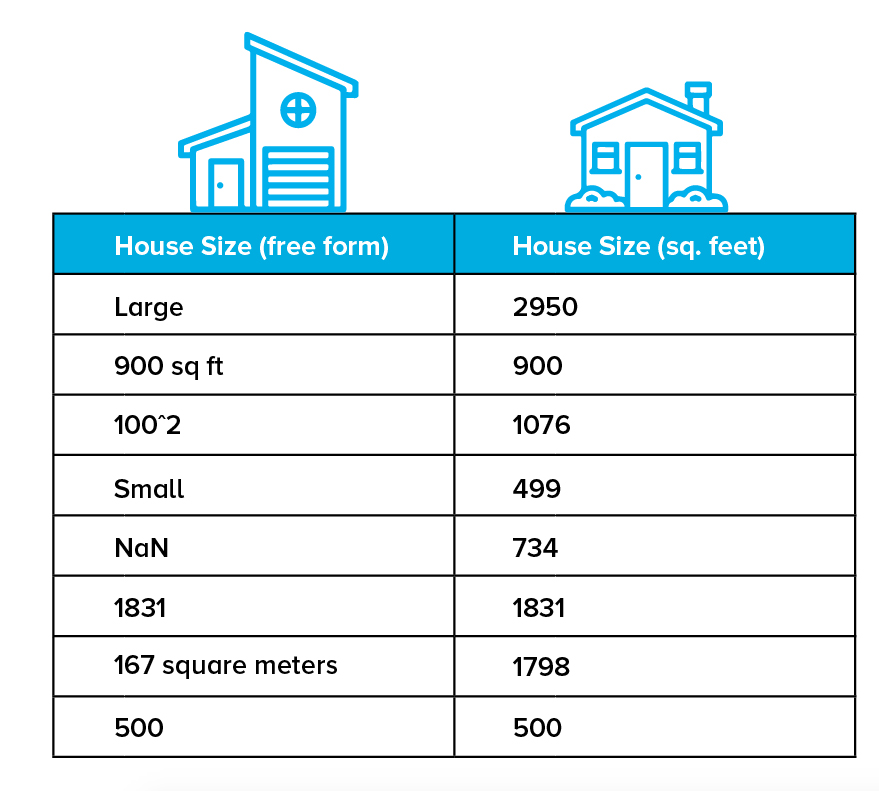

Once you've collected your data, the next step is learning how to manipulate it efficiently. Knowing how to do some basic operations, such as slicing your dataset with conditionals, aggregating entries, and properly searching for values will save you a lot of time when you have to parse through thousands of records.

Pandas is one of the most vital and actively developed high-performance data analysis libraries for Python, and you'll be using it for all your data input, output, and manipulation needs. If you're already familiar with the library NumPy, Pandas will feel right at home since it's built on top of it. To get started with Pandas, import it:


```python
import pandas as pd
```

There are two data structures in Pandas you need to know how to work with. The first is the series object, a one-dimensional labeled array that represents a single column in your dataset. Which of the following two, essentially equal series would you rather work with?

 has no title attribute.

Clearly, the second series will be easier for you to analyze and manipulate. Having all elements share the same units and data type make give you the ability to apply series-wide operations. Because of this, Pandas series must be homogeneous. They're capable of storing any Python data type (integers, strings, floating point numbers, objects, etc.), but all the elements in a series must be of the same data type.

The second structure you need to work with is a collection of series called a dataframe. To manipulate a dataset, you first need to load it into a dataframe. Different people prefer alternative methods of storing their data, so Pandas tries to make loading data easy no matter how it's stored. Here are some methods for loading data:


```python
from sqlalchemy import create_engine
engine = create_engine('sqlite:///:memory:')

sql_dataframe  = pd.read_sql_table('my_table', engine, columns=['ColA', 'ColB'])
xls_dataframe  = pd.read_excel('my_dataset.xlsx', 'Sheet1', na_values=['NA', '?'])
json_dataframe = pd.read_json('my_dataset.json', orient='columns')
csv_dataframe  = pd.read_csv('my_dataset.csv', sep=',')
table_dataframe= pd.read_html('http://page.com/with/table.html')[0]
```

Pay particular attention to the .read_csv() and .read_html() methods. In fact, take time to read over the official Pandas documentation relating to them. Every assignment you complete in this course will need you load up data, so investing time in learning how to do it correctly from the get-go will save you hours of future struggle. Note the return type of .read_html(), it is a Python list of dataframes, one per HTML table found on the webpage. Also make sure you understand fully what the following parameters do:
+ sep
+ delimeter
+ header
+ names
+ index_col
+ skipinitialspace
+ skiprows
+ na_values
+ thousands
+ decimal

Writing an existing dataframe to disk is just as straightforward:


```python
my_dataframe.to_sql('table', engine)
my_dataframe.to_excel('dataset.xlsx')
my_dataframe.to_json('dataset.json')
my_dataframe.to_csv('dataset.csv')
```

Except in certain cases, like a database table where the columns are clearly defined, the first row of your data is used as the column headers. Therefore if your data starts from the first line and you don't actually have a header row, ensure you pass in the names parameter (a list of column header names) when you call any .read_*() method. Pandas will use the provided headers in place of your first data entry.

If you do have column titles already defined in your dataset but wish to rename them, in that case, use the writeable .columns property:


```python
my_dataframe.columns = ['new', 'column', 'header', 'labels']
```

There are many other optional parameters you can tinker with, most existing on both read and write operations. Be sure to check out the Pandas API Reference to see how to make Pandas' powerful I/O work for you. With a dataset loaded into your dataframe, you can now use various methods to examine it.

#### A Quick Peek
To get a quick peek at your data by selecting its top or bottom few rows using .head() and .tail():


```python
df.head(5)
df.info()
```

#### Overall Summary

To see a descriptive statistical summary of your dataframe's numeric columns using .describe():


```python
df.describe(5)
```

#### View Columns
.columns will display the name of the columns in your dataframe:


```python
df.columns
```

#### View Indices
Finally, to display the index values, enter .index:


```python
df.index
```

A note of caution: While generally we would say axis is another word for dimension or feature, Pandas uses the word differently. In Pandas, axes refers to the two-dimensional, matrix-like shape of your dataframe. Samples span horizontal rows and are stacked vertically on top of one another by index (axis=0). Features are vertical spans that are stacked horizontally next to each other by columns (axis=1):

... Picture....

In this context, if you see or hear the term "axis", assume the speaker is talking about the layout of your dataframe as opposed to the dimensionality of your features. We will go into more detail about this as it comes up.

#### View Column DataTypes
When you load up a dataframe, it's always a good idea to see what data type Pandas assigned each column:


```python
df.dtypes
```

Pandas will check your dataset and then on a per-column basis will decide if it's a numeric-type: int32, float32, float64. date-type: datetime64, timedelta[ns]. Or other object-type: object (string), category. If Pandas incorrectly assigns a type to a column, you can convert it, and we'll discuss that later on.


```python

```
